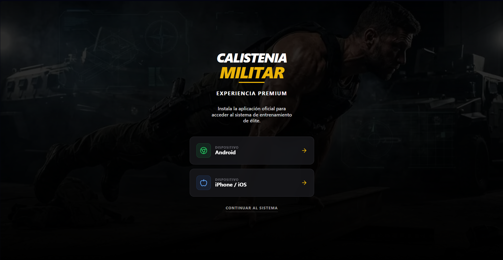

# 💪 App Calistenia



Um projeto completo de Calistenia, com dashboard, protocolos, nutrição, mentalidade e recuperação, feito em Next.js e Supabase. Ideal para quem busca evolução física e mental com metodologia militar.

---

## 🚀 Tecnologias
- [Next.js](https://nextjs.org)
- [Supabase (Postgres)](https://supabase.com)
- [Tailwind CSS](https://tailwindcss.com)
- [TypeScript](https://www.typescriptlang.org/)

---

## ⚙️ Configuração Inicial

1. Clone o repositório e instale as dependências:
   ```bash
   npm install
   # ou
   yarn install
   ```
2. Configure as variáveis de ambiente (`.env`):
   - `SUPABASE_URL`
   - `SUPABASE_SERVICE_ROLE_KEY` (chave **service_role**)
   - `HOTMART_WEBHOOK_SECRET`
   - `APP_URL` (ex: https://seu-dominio.com)
   - `RESEND_API_KEY` (opcional, para e-mail)
   - `EMAIL_FROM` (opcional, ex: Seu App <no-reply@seu-dominio.com>)
3. Crie a tabela `users` no Supabase executando o SQL em [`database/users.sql`](database/users.sql).

---

## 👤 Usuário de Teste (Seed)

Para testar o fluxo de compra e finalização de conta:

1. Execute [`database/seed-test-user.sql`](database/seed-test-user.sql) no SQL Editor do Supabase.
2. Abra o app e use o e-mail: `teste@exemplo.com`
3. O app pedirá para finalizar a conta (criar senha ou gerar automaticamente).

---

## 🖥️ Rodando Localmente

```bash
npm run dev
# ou
yarn dev
# ou
pnpm dev
# ou
bun dev
```

Acesse [calistenia](https://calistenia-ten.vercel.app) para ver o resultado.

Edite a página inicial em `app/page.tsx`. O app atualiza automaticamente.

---

## 📦 Deploy

A forma mais fácil de publicar é pelo [Vercel](https://vercel.com/new?utm_medium=default-template&filter=next.js&utm_source=create-next-app&utm_campaign=create-next-app-readme).

Veja a [documentação de deploy do Next.js](https://nextjs.org/docs/app/building-your-application/deploying).

---

## 📚 Saiba Mais
- [Documentação Next.js](https://nextjs.org/docs)
- [Supabase Docs](https://supabase.com/docs)
- [Tailwind CSS](https://tailwindcss.com/docs)

